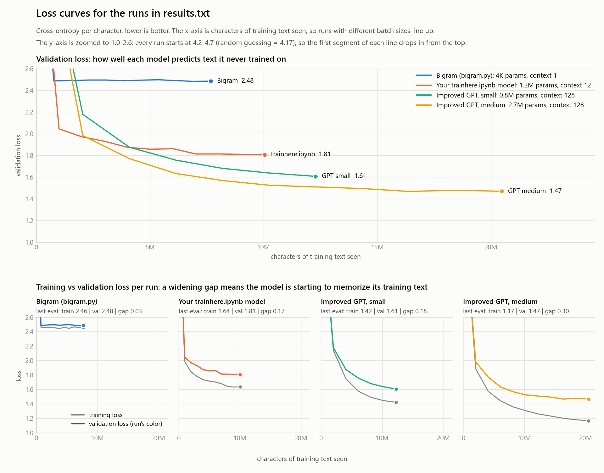

# QUILL - Character-level GPT on Tiny Shakespeare

Quill is a small GPT-style language model that writes text one character at a time. It's built in PyTorch on Andrej Karpathy's nanoGPT lecture code and trained from scratch on Tiny Shakespeare (about 1.1M characters). The main model, Quill-M (2.7M parameters), trains in about an hour on a laptop CPU and reaches a validation loss of 1.47. It writes Shakespeare-style dialogue with character names, verse lines and mostly real words, though not much sense yet. The repo also includes a Wikipedia scraper for collecting more training text.



## Results

| Run | Model | Params | Context | Val loss | Train time (CPU) |
|---|---|---:|---:|---:|---:|
| 1 | Bigram (`bigram.py`) | 4K | 1 char | 2.49 | 0.6 min |
| 2 | TinyTransformer from `trainhere.ipynb`, original settings | 1.2M | 12 chars | 1.78 | 25.6 min |
| 3 | Improved GPT, small | 0.8M | 128 chars | 1.61 | 13.4 min |
| 4 | Improved GPT, medium | 2.7M | 128 chars | **1.47** | 57.8 min |

Val loss is the cross-entropy per character on the last 10% of the text, which the models never train on. Lower is better; random guessing scores 4.17.

- Runs 2 and 3 are about the same size and see about the same amount of text (10-12M characters). The training changes alone take the loss from 1.78 to 1.61, in half the time.
- Run 4 stops improving after about 16M characters, and the gap between its training and validation loss grows to 0.3: it is starting to memorize the training text. More dropout or more data would be the next step, not more iterations.

Every number, the loss curves and 10 generated samples per run are in [`results.txt`](results.txt).

### Sample output

The same prompt and random seed for three of the runs (500 characters are generated; only the start is shown here).

Run 1, bigram:
```
ROMEO:
ORERGBuss wethasuteces thes, merto for be wirlathede tyess ber folde s borantchispor yothathade hil cchigacomy cats t f hinor:
```

Run 2, TinyTransformer from `trainhere.ipynb`:
```
ROMEO:
O, if you we hast
Of sun, hold me to the life,
And all ensing the sensel tongue with you.
```

Run 4, improved GPT medium:
```
ROMEO:
O, then shall be become to remember the place,
And shall scier for thy borne conspires
And made his children like sorrow me wrong.
```

## What's in here

| File | What it is |
|---|---|
| `train_improved.ipynb` | The main notebook. Trains all four runs one after another, saves the best checkpoint of each to `runs/` and writes `results.txt`. Its last cell loads a checkpoint and generates text without retraining. |
| `results.txt` | Summary table, loss curve numbers and 10 samples of 500 characters for every run. |
| `loss_curves.png`, `plot_losses.py` | The chart above. `plot_losses.py` rebuilds it from `runs/train_log.txt`. |
| `runs/` | The best checkpoint of each run (`*.pt`) and the training log. |
| `gpt.py`, `bigram.py` | The scripts from the "Let's build GPT" lecture, fixed so that text generation runs with dropout off and without tracking gradients. |
| `trainhere.ipynb` | The earlier experiment notebook (bigram, MLP and TinyTransformer). Run 2 reproduces its settings. |
| `input.txt` | Tiny Shakespeare, the training text. |
| `more.txt` | 10,000 characters generated by the lecture's full-size `gpt.py` model. |
| `wiki_random_scraper.py` | A separate tool that collects random Wikipedia articles as plain text, for a bigger dataset later. |

## Running it

Python 3.10+ with PyTorch, plus Jupyter and matplotlib for the notebook and the chart:

```bash
pip install torch jupyter matplotlib
```

Open `train_improved.ipynb` and run all cells, or run it headless (the executed notebook is saved in place):

```bash
jupyter nbconvert --to notebook --execute --inplace train_improved.ipynb --ExecutePreprocessor.timeout=-1
```

Then redraw the chart:

```bash
python plot_losses.py
```

Each run is one entry in the `RUNS` list in the notebook's config cell, so sizes and iteration counts are easy to change. A CUDA GPU is used automatically if there is one.

On a CPU-only laptop (Ryzen 5 7530U, 12 threads) the four runs take about 1 hour 40 minutes. Keep the laptop plugged in and awake: sleep pauses the training until it wakes up.

## How long is an output?

The tokenizer works on single characters, so one token is one character. The output length is the `max_new_tokens` argument of `generate()`, counted in characters, so 500 characters is roughly 90 words. In the notebook it is `SAMPLE_CHARS` in the config cell.

A separate limit, `block_size`, is the context window: how many previous characters the model sees when it picks the next one (1 for the bigram, 12 in `trainhere.ipynb`, 128 for the improved GPTs, 256 in `gpt.py`).

## What changed compared to the lecture code

- Text is generated in `eval()` mode under `torch.no_grad()`. The original code sampled with dropout still switched on, which makes the output worse.
- `temperature` and `top_k` options for sampling (the results use temperature 0.8).
- All attention heads are computed in one fused operation (`F.scaled_dot_product_attention`) instead of a Python loop over heads.
- AdamW with weight decay, learning-rate warmup and cosine decay, gradient clipping, GELU and GPT-2 style initialization.
- The checkpoint with the best validation loss is saved and used for sampling.
- Compared with `trainhere.ipynb`: context 12 -> 128 characters, feed-forward width 2048 -> 4x the embedding size, post-norm -> pre-norm, and a learning rate of 1e-3 decaying to 1e-4 instead of a constant 1e-4.

## Wikipedia scraper

`wiki_random_scraper.py` fetches random articles through `Special:Random`, reduces them to plain text (paragraphs, headings and lists, without infoboxes, references or link sections) and saves one `.txt` file per article, with de-duplication in SQLite.

```bash
pip install requests beautifulsoup4 psutil
python wiki_random_scraper.py --out wiki_corpus --workers 4
```

Put your own contact details in `USER_AGENT` before running it for long (Wikimedia asks for this), or use the official Wikipedia dumps for large amounts of text. The scraped articles are not part of this repo.

## Credits

- `gpt.py`, `bigram.py`, `input.txt` and `more.txt` come from Andrej Karpathy's "Let's build GPT" lecture in [Neural Networks: Zero to Hero](https://karpathy.ai/zero-to-hero.html) ([ng-video-lecture](https://github.com/karpathy/ng-video-lecture), MIT license).
- Tiny Shakespeare is from [char-rnn](https://github.com/karpathy/char-rnn).
